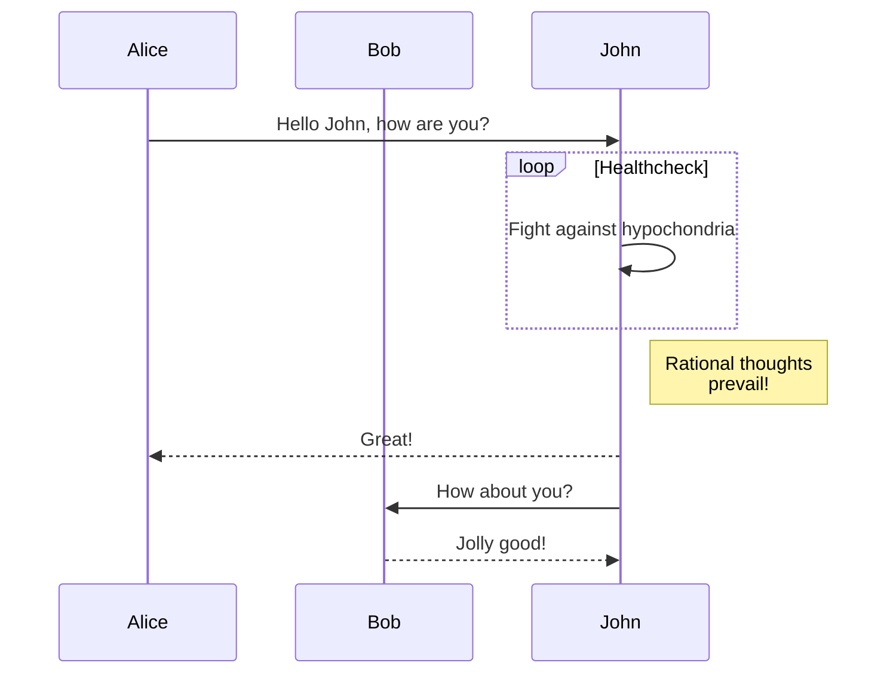
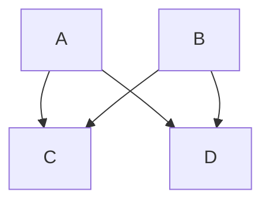

So here we go. Let's type in something interesting and see how it goes. First, let us input some more information. That is whatever it takes, we give it. But that does not mean that we will give them anything. We have a baseline. We need to let them know it. It is alright to negotiate, but under our rules, our terms.

Anna, Naomi, Ida, Ada, Lucia

[mermaid support](https://gohugo.io/content-management/diagrams/)

